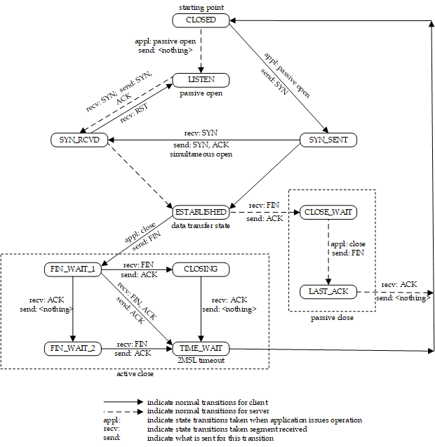
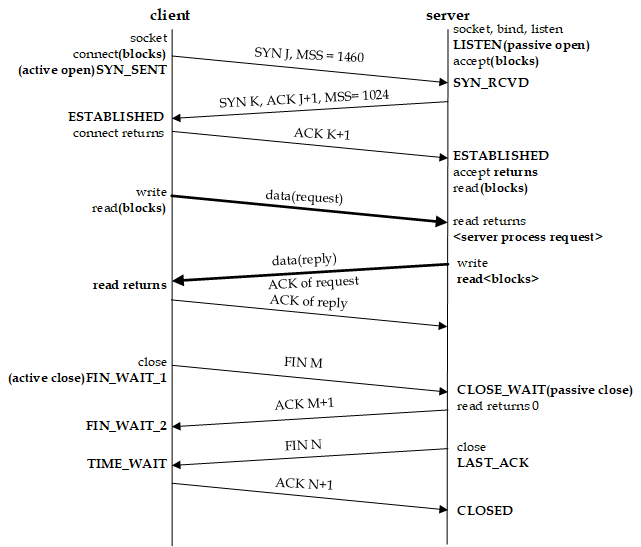
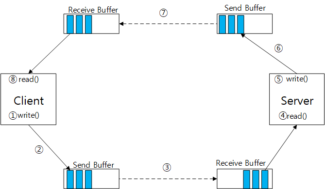

# TCP의 데이터 전송 보장

TCP는 데이터의 전송을 보장하는 신뢰성 있는 프로토콜이다. 호스트간에 갑작스럽게 연결 종료가 되었다거나 전송 지연 등 으로 인해 데이터의 유실 소지가 있는 네트워크 상황에서 TCP는 내부적으로 어떤 원리로 데이터를 보장해주는지 관련 테스트를 통해 알아보기로 했다.

테스트를 진행하기에 앞서 TCP 상태 천이도에 대한 개념이 필요해서 짚고 넘어가게 되었다.


## TCP 상태 천이도

TCP 상태 천이도는 OSI 7계층 중 4계층인 전송계층에서 TCP 프로토콜 통신 과정의 상태와 흐름을 나타낸 도표다.
첫번째 그림은 플로우차트 형식이고 두번째 그림은 시퀀스다이어그램 형식이다.






각 상태들은 다음을 의미한다.

|<center>상태</center>|<center>의미</center>|
|---|---|
|LISTEN|	서버가 소켓을 bind 하고 클라이언트의 접속요청을 기다린다.|
|SYN_SENT|	클라이언트가 서버로 접속 요청을 한다.|
|SYN_RCVD|	서버가 클라이언트로부터 접속 요청을 받고 클라이언트에게 접속 요청 응답을 한다.|
|ESTABLISHED|	클라이언트와 서버가 서로 세션 확립이 이루어졌다.|
|FIN_WAIT_1|	접속을 끊기 위해 소켓을 close하고 close 요청을 한다. close 발생 주체는 서버가 될 수도있고 클라이언트가 될 수도 있다.|
|CLOSE_WAIT|	close 요청을 받고 응답을 보낸다.|
|FIN_WAIT_2|	close 요청에 대한 응답을 받고 최종 응답을 기다린다.|
|LAST_ACK|	소켓을 close를 하고 최종 close 응답을 한다.|
|TIME_WAIT|	최종 close 응답을 받고 미처 처리되지 못한 데이터를 처리하기 위해 일정시간 동안 유지된다.|
|active open|	능동적으로 세션 확립에 대한 요청을 하는 과정으로 보통 클라이언트에서 이루어진다. 클라이언트가 포트를 개방하고 서버에 접속 요청을 하는 것을 예로 들 수 있다.|
|passive open|	수동적으로 세션 확립에 대한 요청을 받는 과정으로 보통 서버에서 이루어진다. 서버가 포트를 개방하고 클라이언트의 접속 요청을 대기하는 것을 예로 들 수 있다.|
|active close|	능동적으로 세션 해제를 발생시키는 과정으로 서버가 될 수도있고 클라이언트가 될 수도있다. 클라이언트가 접속을 끊거나 서버가 접속을 끊는것을 예로 들 수 있다.|
|passive open|	수동적으로 세션 해제에 대한 요청을 받는 과정으로 마찬가지로 서버가 될 수도 있고 클라이언트가 될 수도있다.|


다음은 세그먼트들에 대한 설명이다. 세그먼트는 전송 계층에서의 데이터 전송 단위를 의미한다.

|<center>세그먼트</center>|<center>의미</center>|
|---|---|
|SYN(Synchronize)|	연결 시작, 회선 개설 요청에 사용되는 세그먼트다. TCP 에서는 접속 요청을 하는 주체가 SYN 세그먼트를 전송하고 요청을 받는 주체는 여기에 값을 추가해서 응답한다.|
|ACK(Acknowledgement)|	요청에 대한 응답 세그먼트다.|
|RST(Reset)|	연결 리셋에 대한 세그먼트로 유효하지 않은 연결에 대한 시도를 했다거나 통신의 연결 및 종료를 정상적으로 할 수 없을때 사용된다.|
|FIN(Finish)|	연결 해제, 회선 종결 요청에 사용되는 세그먼트다.|
|MTU(Maximum Transmission Unit)|	MTU는 그림에는 나와있지 않지만 MSS의 설명이 필요하기 때문에 언급하게 되었다. MTU란 TCP/IP 네트워크 등과 같은 패킷 또는 프레임 기반의 네트워크에서 한번에 전송될 수 있는 최대 크기의 패킷 또는 프레임을 말한다. 단위는 Byte이며 MTU 값은 네트워크 인터페이스나 대역폭 등 네트워크 환경에 따라 달라질 수 있는데 일반적으로 흔히 쓰이는 이더넷의 경우 MTU 값은 1500을 사용하고, FDDI는 4000, X.25는 576, Gigabit는 9000정도를 사용한다.|
|MSS(Maximum Segment Size)|	MTU에서 헤더를 제외한 TCP상에서 전송 할 수 있는 사용자 데이터의 최대 크기에 해당하는 세그먼트다. 위 그림에서는 처음 접속 요청시 1460바이트에 해당하는 MSS를 전송하고 있다. 이것은 이더넷과같은 환경에서 MTU를 1500으로 사용했을 때 여기에 IPv4 헤더의 20바이트와 TCP 헤더의 20바이트를 뺀 값이다. 그리고 응답시에는 1024바이트로 응답하는데 이것은 1024바이트의 크기의 단위로 데이터를 전송하겠다는것을 의미한다.|


## 테스트

### 테스트 환경
* OS : Linux CentOS 7
* 클라이언트/서버 애플리케이션 언어 : C

리눅스에서 TCP는 통신시 데이터를 효율적으로 전송하기 위해 버퍼라고 하는 임시 데이터 공간을 사용한다. 이것으로 인해 응용프로그램으로부터 생성된 소켓은 소켓마다 시스템으로부터 일정 크기의 송신버퍼와 수신버퍼를 할당받게 된다.

다음 그림은 클라이언트 서버 모델에서의 소켓 버퍼 동작 구조를 표현한 것이다. 이는 클라이언트에서 서버로 데이터를 보내고 응답받는 과정에 해당한다. 클라이언트, 서버 각각 자신의 소켓 버퍼를 가지고 있는 것을 알 수 있다.
응용 프로그램에서는 데이터를 read/write 하게 되고 해당 데이터는 버퍼를 통해 전송된다.



1. 클라이언트에서 서버에 보낼 데이터를 write 한다.
2. 데이터가 클라이언트의 송신 버퍼(Send Buffer)에 적재된다.
3. 적재된 데이터가 서버의 수신 버퍼(Receive Buffer)에 전송된다.
4. 서버가 수신버퍼에 적재된 데이터를 read한다.
5. 서버에서 클라이언트에게 응답할 데이터를 write 한다.
6. 데이터가 서버의 송신버퍼에 적재된다.
7. 적재된 데이터가 클라이언트의 수신 버퍼에 전송된다.
8. 클라이언트가 수신버퍼에 적재된 데이터를 read한다.


사용자가 직접 버퍼 사이즈를 조정할 수 도있다. C에서는 소켓 버퍼 사이즈를 설정할 수 있는 소켓 옵션(SO_SNDBUF, SO_RCVBUF)을 제공해준다. 여기서 유의해야할 점은 <U>설정 값이 그대로 적용 되는게 아니라 커널상에서 사용자가 설정한 값을 기반으로 임의로 적용</U> 된다는 것이다. 그래서 설정한 값에 대한 재확인이 필요할 수 있다.

버퍼를 이용한 통신 구조를 보면 서버 입장에서 수신 버퍼에 쌓여있던 데이터는 "수신하려 했던 데이터" 에 해당하고 클라이언트 입장에서 송신 버퍼에 쌓여있던 데이터는 "송신하려 했던 데이터" 에 해당 하는것으로 여길 수 있다.
만약 응용프로그램이 갑작스럽게 종료되어 세션이 끊긴다면 버퍼에 남아있는 데이터들은 어떻게 되는것일까? 이에 대한 테스트를 진행해보기 위해 다음과 같은 시나리오를 구상해보게 되었다.

다음 과정은 서버 클라이언트 통신 중 세션이 끊겼을 시 버퍼에 남아있는 데이터가 어떻게 처리되는 지를 재현해보기 위한 시나리오다.

1. 클라이언트에서 서버에 데이터를 write 한다.
2. 서버에서 클라이언트의 데이터를 read 하기전에 임의대로 행을 걸어놓고 read를 하지못하게 막는다.
3. 1번 과정을 반복해서 서버의 수신버퍼와 클라이언트의 송신버퍼에 패킷이 쌓이도록 한다.
4. 클라이언트 응용프로그램을 강제로 종료해서 연결을 끊는다.
5. 서버의 행을 풀고 쌓여있던 모든 패킷을 read 한다.


## 테스트 결과

다음은 서버측과 클라이언트 측의 테스트 로그 출력 결과다. 로그 출력을 위해 netstat를 활용했다. netstat를 이용하면 실시간으로 로컬의 네트워크 상태와 소켓 버퍼의 상태를 알 수 있다.

로그상에서는 클라이언트가 언제 close를 했는지 알 수 없다. 이유는 클라이언트 버퍼로부터 패킷을 받는 시점에 세션 상태가 CLOSE_WAIT으로 바뀌었기 때문이다. 이를 통해 시스템에서 연동 호스트의 close 여부는 버퍼에 패킷이 채워지는 시점에 알 수 있다는것을 알게되었다.
클라이언트의 송신버퍼가 꽉찼을 경우엔 클라이언트소켓이 블락상태가 되고 서버가 read를 해주기 전까지는 더이상 write를 할 수 없다는것도 알 수 있었다.
결과적으로 버퍼가 모두 비워지기 전까진 세션 상태가 CLOSE_WAIT 인 상태에 머무르고 데이터 또한 모두 read하는 것을 볼 수 있는데 이것으로 세션이 끊긴 상황에서 시스템측에서는 해당 세션에 대해 CLOSE_WAIT 상태에 머무르며 버퍼에 남아있는 데이터들이 보장 된다는 것을 알 수 있었다.

**(서버 로그)**
```
     (수신 버퍼)                                                      상태
tcp        0      0 0.0.0.0:8002            0.0.0.0:*               LISTEN
tcp        0      0 192.168.0.195:8002      192.168.0.192:57686     ESTABLISHED
tcp        0      0 0.0.0.0:8002            0.0.0.0:*               LISTEN
tcp        0      0 192.168.0.195:8002      192.168.0.192:57686     ESTABLISHED
tcp        0      0 0.0.0.0:8002            0.0.0.0:*               LISTEN
tcp        0      0 192.168.0.195:8002      192.168.0.192:57686     ESTABLISHED
tcp        0      0 0.0.0.0:8002            0.0.0.0:*               LISTEN
tcp        0      0 192.168.0.195:8002      192.168.0.192:57686     ESTABLISHED
tcp        0      0 0.0.0.0:8002            0.0.0.0:*               LISTEN
tcp        0      0 192.168.0.195:8002      192.168.0.192:57686     ESTABLISHED
tcp        0      0 0.0.0.0:8002            0.0.0.0:*               LISTEN
tcp        0      0 192.168.0.195:8002      192.168.0.192:57686     ESTABLISHED
tcp        0      0 0.0.0.0:8002            0.0.0.0:*               LISTEN
tcp     1024      0 192.168.0.195:8002      192.168.0.192:57686     ESTABLISHED
tcp        0      0 0.0.0.0:8002            0.0.0.0:*               LISTEN
tcp     3072      0 192.168.0.195:8002      192.168.0.192:57686     ESTABLISHED
tcp        0      0 0.0.0.0:8002            0.0.0.0:*               LISTEN
tcp     6144      0 192.168.0.195:8002      192.168.0.192:57686     ESTABLISHED
tcp        0      0 0.0.0.0:8002            0.0.0.0:*               LISTEN
tcp     9216      0 192.168.0.195:8002      192.168.0.192:57686     ESTABLISHED
tcp        0      0 0.0.0.0:8002            0.0.0.0:*               LISTEN
tcp    10240      0 192.168.0.195:8002      192.168.0.192:57686     ESTABLISHED
tcp        0      0 0.0.0.0:8002            0.0.0.0:*               LISTEN
tcp    12288      0 192.168.0.195:8002      192.168.0.192:57686     ESTABLISHED
tcp        0      0 0.0.0.0:8002            0.0.0.0:*               LISTEN
tcp    14336      0 192.168.0.195:8002      192.168.0.192:57686     ESTABLISHED
tcp        0      0 0.0.0.0:8002            0.0.0.0:*               LISTEN
tcp    15360      0 192.168.0.195:8002      192.168.0.192:57686     ESTABLISHED
tcp        0      0 0.0.0.0:8002            0.0.0.0:*               LISTEN
tcp    16384      0 192.168.0.195:8002      192.168.0.192:57686     ESTABLISHED
*******************************************************************************
수신 버퍼가 꽉찬 시점
*******************************************************************************
tcp        0      0 0.0.0.0:8002            0.0.0.0:*               LISTEN
tcp    16384      0 192.168.0.195:8002      192.168.0.192:57686     ESTABLISHED
tcp        0      0 0.0.0.0:8002            0.0.0.0:*               LISTEN
tcp    16384      0 192.168.0.195:8002      192.168.0.192:57686     ESTABLISHED
tcp        0      0 0.0.0.0:8002            0.0.0.0:*               LISTEN
tcp    16384      0 192.168.0.195:8002      192.168.0.192:57686     ESTABLISHED
tcp        0      0 0.0.0.0:8002            0.0.0.0:*               LISTEN
tcp    16384      0 192.168.0.195:8002      192.168.0.192:57686     ESTABLISHED
tcp        0      0 0.0.0.0:8002            0.0.0.0:*               LISTEN
tcp    16384      0 192.168.0.195:8002      192.168.0.192:57686     ESTABLISHED
tcp        0      0 0.0.0.0:8002            0.0.0.0:*               LISTEN
*******************************************************************************
read 시작
*******************************************************************************
tcp    15360      0 192.168.0.195:8002      192.168.0.192:57686     ESTABLISHED
tcp        0      0 0.0.0.0:8002            0.0.0.0:*               LISTEN
tcp    13312      0 192.168.0.195:8002      192.168.0.192:57686     ESTABLISHED
tcp        0      0 0.0.0.0:8002            0.0.0.0:*               LISTEN
tcp    10240      0 192.168.0.195:8002      192.168.0.192:57686     ESTABLISHED
tcp        0      0 0.0.0.0:8002            0.0.0.0:*               LISTEN
tcp     8192      0 192.168.0.195:8002      192.168.0.192:57686     ESTABLISHED
tcp        0      0 0.0.0.0:8002            0.0.0.0:*               LISTEN
tcp     3072      0 192.168.0.195:8002      192.168.0.192:57686     ESTABLISHED
tcp        0      0 0.0.0.0:8002            0.0.0.0:*               LISTEN
tcp    20697      0 192.168.0.195:8002      192.168.0.192:57686     CLOSE_WAIT
*******************************************************************************
클라이언트 송신 버퍼로부터 패킷을 받아 다시 버퍼가 차는 시점
세션 상태 CLOSE_WAIT로 진입
*******************************************************************************
tcp        0      0 0.0.0.0:8002            0.0.0.0:*               LISTEN
tcp    15577      0 192.168.0.195:8002      192.168.0.192:57686     CLOSE_WAIT
tcp        0      0 0.0.0.0:8002            0.0.0.0:*               LISTEN
tcp    10457      0 192.168.0.195:8002      192.168.0.192:57686     CLOSE_WAIT
tcp        0      0 0.0.0.0:8002            0.0.0.0:*               LISTEN
tcp     6361      0 192.168.0.195:8002      192.168.0.192:57686     CLOSE_WAIT
tcp        0      0 0.0.0.0:8002            0.0.0.0:*               LISTEN
tcp     1241      0 192.168.0.195:8002      192.168.0.192:57686     CLOSE_WAIT
tcp        0      0 0.0.0.0:8002            0.0.0.0:*               LISTEN
*******************************************************************************
모든 버퍼를 다 받은 후 클라이언트 세션 close
*******************************************************************************
tcp        0      0 0.0.0.0:8002            0.0.0.0:*               LISTEN
tcp        0      0 0.0.0.0:8002            0.0.0.0:*               LISTEN
tcp        0      0 0.0.0.0:8002            0.0.0.0:*               LISTEN
tcp        0      0 0.0.0.0:8002            0.0.0.0:*               LISTEN
tcp        0      0 0.0.0.0:8002            0.0.0.0:*               LISTEN
tcp        0      0 0.0.0.0:8002            0.0.0.0:*               LISTEN
tcp        0      0 0.0.0.0:8002            0.0.0.0:*               LISTEN
tcp        0      0 0.0.0.0:8002            0.0.0.0:*               LISTEN
tcp        0      0 0.0.0.0:8002            0.0.0.0:*               LISTEN
tcp        0      0 0.0.0.0:8002            0.0.0.0:*               LISTEN
tcp        0      0 0.0.0.0:8002            0.0.0.0:*               LISTEN
```

**(클라이언트 로그)**
```
            (송신 버퍼)                                                상태
tcp        0      0 192.168.0.192:57686     192.168.0.195:8002      ESTABLISHED
tcp        0      0 192.168.0.192:57686     192.168.0.195:8002      ESTABLISHED
tcp        0      0 192.168.0.192:57686     192.168.0.195:8002      ESTABLISHED
tcp        0      0 192.168.0.192:57686     192.168.0.195:8002      ESTABLISHED
tcp        0      0 192.168.0.192:57686     192.168.0.195:8002      ESTABLISHED
tcp        0      0 192.168.0.192:57686     192.168.0.195:8002      ESTABLISHED
tcp        0      0 192.168.0.192:57686     192.168.0.195:8002      ESTABLISHED
tcp        0      0 192.168.0.192:57686     192.168.0.195:8002      ESTABLISHED
tcp        0      0 192.168.0.192:57686     192.168.0.195:8002      ESTABLISHED
tcp        0      0 192.168.0.192:57686     192.168.0.195:8002      ESTABLISHED
tcp        0      0 192.168.0.192:57686     192.168.0.195:8002      ESTABLISHED
tcp        0      0 192.168.0.192:57686     192.168.0.195:8002      ESTABLISHED
tcp        0      0 192.168.0.192:57686     192.168.0.195:8002      ESTABLISHED
tcp        0      0 192.168.0.192:57686     192.168.0.195:8002      ESTABLISHED
tcp        0   2048 192.168.0.192:57686     192.168.0.195:8002      ESTABLISHED
tcp        0   4096 192.168.0.192:57686     192.168.0.195:8002      ESTABLISHED
tcp        0   6144 192.168.0.192:57686     192.168.0.195:8002      ESTABLISHED
tcp        0   9216 192.168.0.192:57686     192.168.0.195:8002      ESTABLISHED
tcp        0  10240 192.168.0.192:57686     192.168.0.195:8002      ESTABLISHED
tcp        0  12288 192.168.0.192:57686     192.168.0.195:8002      ESTABLISHED
tcp        0  14336 192.168.0.192:57686     192.168.0.195:8002      ESTABLISHED
tcp        0  17408 192.168.0.192:57686     192.168.0.195:8002      ESTABLISHED
tcp        0  18432 192.168.0.192:57686     192.168.0.195:8002      ESTABLISHED
tcp        0  19456 192.168.0.192:57686     192.168.0.195:8002      ESTABLISHED
tcp        0  21504 192.168.0.192:57686     192.168.0.195:8002      ESTABLISHED
*******************************************************************************
송신 버퍼가 꽉찬 시점
*******************************************************************************
tcp        0  21720 192.168.0.192:57686     192.168.0.195:8002      ESTABLISHED
tcp        0  21720 192.168.0.192:57686     192.168.0.195:8002      ESTABLISHED
tcp        0  21720 192.168.0.192:57686     192.168.0.195:8002      ESTABLISHED
tcp        0  21720 192.168.0.192:57686     192.168.0.195:8002      ESTABLISHED
tcp        0  21720 192.168.0.192:57686     192.168.0.195:8002      ESTABLISHED
tcp        0  21720 192.168.0.192:57686     192.168.0.195:8002      ESTABLISHED
tcp        0  21720 192.168.0.192:57686     192.168.0.195:8002      ESTABLISHED
*******************************************************************************
클라이언트 close
서버로부터 close ACK를 받을때까지 FIN_WAIT1 상태 진입
*******************************************************************************
tcp        0  21721 192.168.0.192:57686     192.168.0.195:8002      FIN_WAIT1
tcp        0  21721 192.168.0.192:57686     192.168.0.195:8002      FIN_WAIT1
tcp        0  21721 192.168.0.192:57686     192.168.0.195:8002      FIN_WAIT1
tcp        0  21721 192.168.0.192:57686     192.168.0.195:8002      FIN_WAIT1
tcp        0  21721 192.168.0.192:57686     192.168.0.195:8002      FIN_WAIT1
tcp        0  21721 192.168.0.192:57686     192.168.0.195:8002      FIN_WAIT1
tcp        0  21721 192.168.0.192:57686     192.168.0.195:8002      FIN_WAIT1
tcp        0  21721 192.168.0.192:57686     192.168.0.195:8002      FIN_WAIT1
tcp        0  21721 192.168.0.192:57686     192.168.0.195:8002      FIN_WAIT1
tcp        0  21721 192.168.0.192:57686     192.168.0.195:8002      FIN_WAIT1
tcp        0  21721 192.168.0.192:57686     192.168.0.195:8002      FIN_WAIT1
tcp        0  21721 192.168.0.192:57686     192.168.0.195:8002      FIN_WAIT1
tcp        0  21721 192.168.0.192:57686     192.168.0.195:8002      FIN_WAIT1
tcp        0      0 192.168.0.192:57686     192.168.0.195:8002      FIN_WAIT2
*******************************************************************************
서버의로부터 close ACK를 받고 수신 버퍼가 비면 송신 버퍼에 남아있는 패킷 전송
서버로부터 FIN 응답을 받을때까지 FIN_WAIT2 상태 진입
*******************************************************************************
tcp        0      0 192.168.0.192:57686     192.168.0.195:8002      FIN_WAIT2
tcp        0      0 192.168.0.192:57686     192.168.0.195:8002      FIN_WAIT2
tcp        0      0 192.168.0.192:57686     192.168.0.195:8002      FIN_WAIT2
*******************************************************************************
서버로부터 FIN 응답을 받고 TIME_WAIT 상태 진입
*******************************************************************************
tcp        0      0 192.168.0.192:57686     192.168.0.195:8002      TIME_WAIT
tcp        0      0 192.168.0.192:57686     192.168.0.195:8002      TIME_WAIT
tcp        0      0 192.168.0.192:57686     192.168.0.195:8002      TIME_WAIT
tcp        0      0 192.168.0.192:57686     192.168.0.195:8002      TIME_WAIT
tcp        0      0 192.168.0.192:57686     192.168.0.195:8002      TIME_WAIT
tcp        0      0 192.168.0.192:57686     192.168.0.195:8002      TIME_WAIT
tcp        0      0 192.168.0.192:57686     192.168.0.195:8002      TIME_WAIT
tcp        0      0 192.168.0.192:57686     192.168.0.195:8002      TIME_WAIT
tcp        0      0 192.168.0.192:57686     192.168.0.195:8002      TIME_WAIT
tcp        0      0 192.168.0.192:57686     192.168.0.195:8002      TIME_WAIT
tcp        0      0 192.168.0.192:57686     192.168.0.195:8002      TIME_WAIT
tcp        0      0 192.168.0.192:57686     192.168.0.195:8002      TIME_WAIT
tcp        0      0 192.168.0.192:57686     192.168.0.195:8002      TIME_WAIT
tcp        0      0 192.168.0.192:57686     192.168.0.195:8002      TIME_WAIT
```

**(서버 read 결과)**
```
Server receive buffer size: 16384

read: 1
read: 2
read: 3
read: 4
read: 5
read: 6
read: 7
read: 8
read: 9
read: 10
read: 11
read: 12
read: 13
read: 14
read: 15
read: 16
read: 17
read: 18
read: 19
read: 20
read: 21
read: 22
read: 23
read: 24
read: 25
read: 26
read: 27
read: 28
read: 29
read: 30
read: 31
read: 32
read: 33
read: 34
read: 35
read: 36
read: 37
read: 38
```


이것으로 TCP가 데이터를 보장과 관련된 한가지 예를 알아보았다. TCP 데이터 전송 보장에 대한 동작 원리를 이해하고 있다면 신뢰성있는 프로토콜 기반의 네트워크 인프라에서 이슈 대처에 도움이 될것으로 본다.